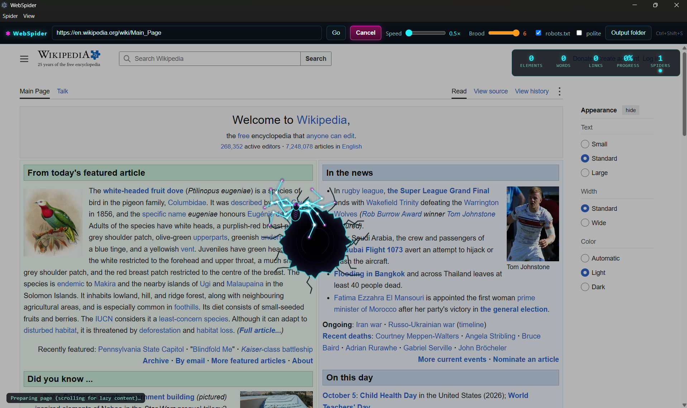
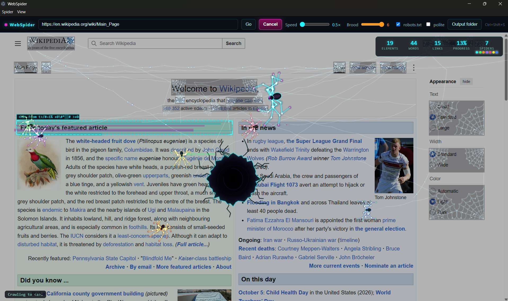

<div align="center">

# 🕷️ WebSpider

**A procedural, inverse-kinematics spider that crawls and scrapes a web page in front of you, then leaves it covered in cobwebs.**


</div>

WebSpider is an Electron desktop app. Open any website, press **Summon Spider**, and a hole tears open on the page. A neon spider climbs out, hatches colourful baby spiders, and together they scrape the page element by element. When they finish, the page looks eaten and webbed, and the app saves the scraped data plus a readable summary.

## 📸 Screenshots

**The hole opens and the spider climbs out**



**The brood scrapes the page together**



## ✨ Features

- **Procedural IK spider:** 8 legs with 3 segments each, solved with FABRIK. Alternating-tetrapod gait, feet that snap onto real text and links, spring-damper body, breathing, glowing eyes.
- **10-second emergence:** a cracked hole irises open, debris falls, the screen shakes, and the spider pulls itself out leg by leg.
- **Brood mode:** baby spiders in different colours hatch from the mother and share one reading-order queue, so pages finish faster. Set 0-6 with the Brood slider.
- **Visible scraping:** coloured boxes (cyan headings, magenta links, orange paragraphs, green images), text glitch effects, and snippets pulled into the spider's mouth. A live HUD shows elements, words, links and progress.
- **Webbed finale:** drained-page overlay, cobweb corners, sagging silk strands with dew drops, and the spider resting in the biggest web.
- **Automatic output:** `summary.md`, `data.json`, `content.txt` and `screenshot.png`.
- **Offline summarizer:** TF-IDF and TextRank, with a "What this website is about" section, topics, a section-by-section digest, insights and stats. An optional LLM hook is available and off by default.
- **Polite by design:** robots.txt toggle, polite-mode delay, adjustable speed, cancel any time (partial results still save).

The real page is never modified. All effects are drawn on a transparent overlay canvas.

## 🚀 Quick start (Windows)

Requires [Node.js](https://nodejs.org) 18 or newer.

```powershell
git clone https://github.com/JARVIS1069/WebSpider.git
cd WebSpider
npm install
npm start
```

1. Type a URL in the top bar.
2. Press **Summon Spider** (or **Ctrl+Shift+S**; press again to cancel).
3. Watch the crawl. When the toast says "Scrape complete", click **Open folder**.

Run the headless end-to-end test with `npm run selftest`.

## 🎛️ Controls

| Control | What it does |
|---|---|
| URL box | Page to scrape |
| Summon Spider / `Ctrl+Shift+S` | Start or cancel a run |
| Speed slider | How fast the spiders work |
| Brood slider | Number of baby spiders (0-6) |
| Output folder | Where results are saved |
| Respect robots.txt | Skip pages disallowed by robots.txt |
| Polite mode | Adds a delay between elements |

## 📂 Output

Saved to `Documents/WebSpider/<domain>_<YYYY-MM-DD_HH-mm>/`:

| File | Contents |
|---|---|
| `summary.md` | About the site, overview, section digest, key insights, outline, stats, top external domains |
| `data.json` | Structured headings, paragraphs, lists, links, images, tables, code and metadata |
| `content.txt` | Clean readable text |
| `screenshot.png` | The webbed page |

## 🧩 Architecture

```
main.js              Electron main: window, hotkey, robots.txt, screenshot, saving
preload.js           Safe window.webSpider bridge (contextIsolation on)
webview-preload.js   Bridge inside the scraped page
scraper.js           In-page scraper, driven over IPC
summarizer.js        Offline summary and output builders
llm-hook.example.js  Optional LLM hook (WEBSPIDER_LLM=1)
renderer/
  spider.js          FABRIK IK solver and gait
  hole.js            Emergence hole
  web.js             Silk, drained overlay, cobwebs
  fx.js              Particles, scan boxes, snippets
  renderer.js        Timeline, brood workers, HUD
```

## 🤖 Optional LLM summary

Copy `llm-hook.example.js` to `llm-hook.js`, implement it with your provider, and start with `WEBSPIDER_LLM=1`. It is disabled by default, so nothing leaves your machine unless you turn it on.

## ⚠️ Responsible use

Only scrape sites you are allowed to scrape. Keep robots.txt enabled and polite mode on, and follow each site's terms of service.

## 🗺️ Ideas

Sound effects, spider skins, multi-page crawl, PDF export, screen-recording the run, LLM summaries.

## 📄 License

MIT


